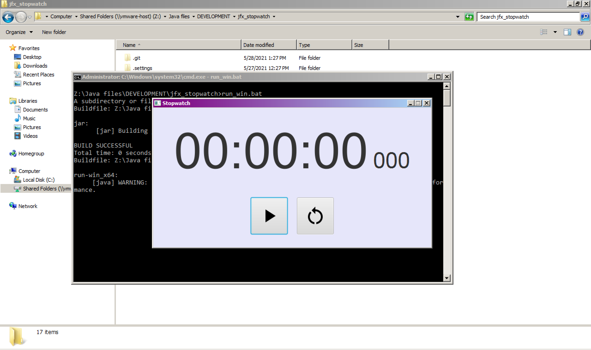
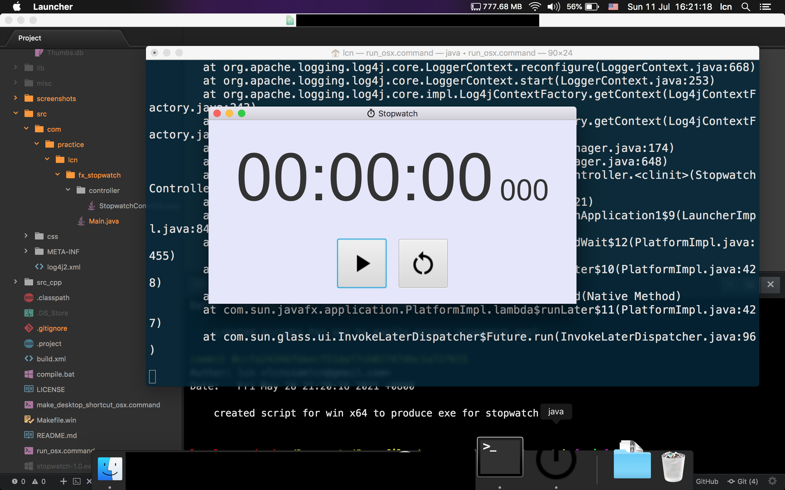

# JavaFX Stopwatch

This project attempts to create a stopwatch using JavaFX.

## Compatibility

This program is compatible with

- Windows x64
- Mac OS X x64

## Windows Environment

- OpenJDK 11
- JavaFX SDK 11.0.2 (x64)
- Apache Ant 1.9.14
- commons-lang-2.6.jar
- log4j-api-2.12.1.jar
- log4j-core-2.12.1.jar
- g++
- make

## Mac OS X Environment

- OpenJDK 11
- JavaFX SDK 11.0.2 (x64)
- Apache Ant 1.10.6
- commons-lang-2.6.jar
- log4j-api-2.12.1.jar
- log4j-core-2.12.1.jar

## Installation steps (Windows)

1. create a `lib` folder under `${PROJECT_DIR}`
2. download all above-mentioned libraries depending on your OS
3. put all downloaded libraries to `${PROJECT_DIR}/lib`
4. import this project to eclipse
5. use eclipse to compile this project
6. execute
```bat
compile.bat
```

The executable `${PROJECT_DIR}/stopwatch-${version}.exe` should be generated.

## Installation steps (Mac OS X)

1. create a `lib` folder under `${PROJECT_DIR}`
2. download all above-mentioned libraries depending on your OS
3. put all downloaded libraries to `${PROJECT_DIR}/lib`
4. import this project to eclipse
5. use eclipse to compile this project
6. double click `${PROJECT_DIR}/make_desktop_shortcut_osx.command` to create desktop shortcut for the stopwatch application
7. double click `${DESKTOP_DIR}/stopwatch-${version}.command` to launch the stopwatch application

## Screenshots

Windows



Mac OS X



## License

This application is under GPL v3.0 license. Feel free to modify and add more features to the application. If you use this application for production, please credit my work. Thanks.
